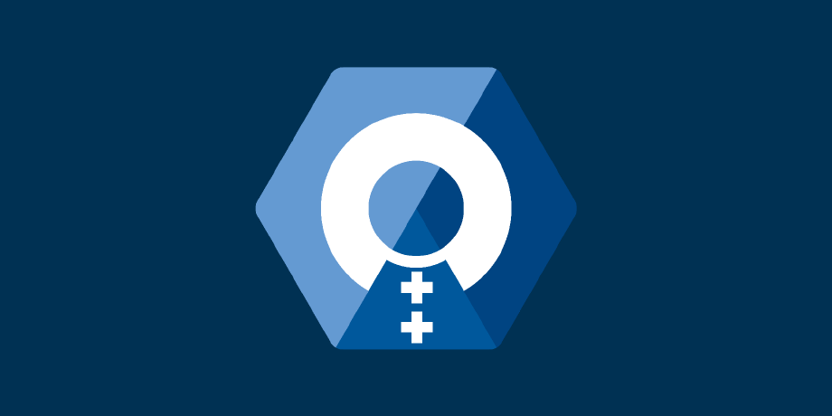

# Verbose

    

![[inline_neovim.svg]]
![[inline_golang.svg]]
![[inline_c.svg]]
![[inline_cpp.svg]]
![[inline_lua.svg]]
![[inline_python.svg]]
![[inline_latex.svg]]
![[inline_markdown.svg]]
![[inline_postgresql.svg]]
![[inline_redis.svg]]
![[inline_docker.svg]]
![[inline_kubernetes.svg]]
![[inline_github_actions.svg]]

## General
- **Full Name:** Anton Martyukov / Антон Мартюков
- **Unique Name:** atennop
- **Height:** 5'11" / 180cm
- **Weight:** 139lbs / 63kg
- **Eye Color:** green
- **Age:**  y.o.
- **Death Chance:** <a class="internal" style=" font-weight: bold; text-align: center; display: inline-block; width: 160px; vertical-align: middle;"></a> per year
- **Company**: none _yet_
- **Timezone:** UTC+3
- **City:** Moscow, Russia
- **Favorite Subject in School**: CS (who'd guess!)
- **T-Shirt Size**: L
- **NeoVim Config**: [dotfiles/nvim](https://github.com/Atennop1/dotfiles/tree/main/nvim)
- **Marital Status**: _segmentation fault_

## Projects

### In backend

- [[.|blog]] – this website where I share random notes with world
- [Friendly CLI](https://github.com/friendly-social/cli) – client for Friendly social network
- TBA trading project

I moved to backend not so early so there is not much to share _yet_.

### In gamedev
- [**Genesis**](https://github.com/Atennop1/Genesis) – my own 2D OOP game engine in C++
- [**ArkanoidWithoutAnEngine**](https://github.com/Atennop1/ArkanoidWithoutAnEngine) – a game built fully from scratch with it
- [**UnrealShooter**](https://github.com/Atennop1/UnrealShooter) - my first project created with Unreal
- [**Relational-Databases-Via-OOP**](https://github.com/Atennop1/Relational-Databases-Via-OOP) – experimental library for working with databases in OOP style
- [**SavannaSprint**](https://github.com/Atennop1/SavannaSprint) – my first released game (2021, Google Play)

Those are completed and actually useful or really meaningful projects I am proud to share. But there are also a lot of
other little stuff in my archived GitHub repos.

## Work Experience

- **BigTech** (someday)
   I wanna move from gamedev on C# / C++ to backend in Go and be hired as Middle engineer by the beginning of my second
  year in university.
- **Learning and making personal projects** (2021 - present)
   I was learning gamedev, first Unity and then Unreal Engine, and later decided to move to backend ([[content/field_switch.md|here]] is why), so official start of my
  career is delayed second time, which obviously makes me sad.

## Education

- **Master's Degree** (someday - someday + 2)
   My dream is to move to USA and apply for Master's, preferably in Stanford University. I don't have any ideas how I will manage to do this yet.
- **Bachelor's Degree** (2025 - 2029)
   Software Engineering at [FinUniver / ФинУнивер ](https://en.wikipedia.org/wiki/Financial_University_under_the_Government_of_the_Russian_Federation) ([[content/university_choice.md|here]] is explanation of my choice)

## Languages 

- **English** (Fluent): _everybody speaks that_
- **Russian** (Native): _mother tongue_

## Socials

- ![[inline_telegram.png|13]] **DM:** [@atennop](https://t.me/atennop) – _primary_
- ![[inline_telegram.png|13]] **Channel:** [@atennopmeta](https://t.me/atennopmeta) – _updates_
- ![[inline_obsidian.png|13]] **Blog:** [[.|index]] – _this website with random notes_
- ![[inline_x.svg|13]] **X:** [@atennop](https://x.com/atennop) – _my dumb tweets_
- ![[inline_github.png|13]] **GitHub:** [Atennop1](https://github.com/Atennop1) – _we can collab maybe_
- ![[inline_gmail.png|13]] **Email**: atennop@gmail.com – _i reply pretty fast_

## Political Views

I stand for free within society from oppressive restrictions imposed by authority on one's way of life, behavior, or political views. 
I believe that someday it will stop being my dream and become a reality.

